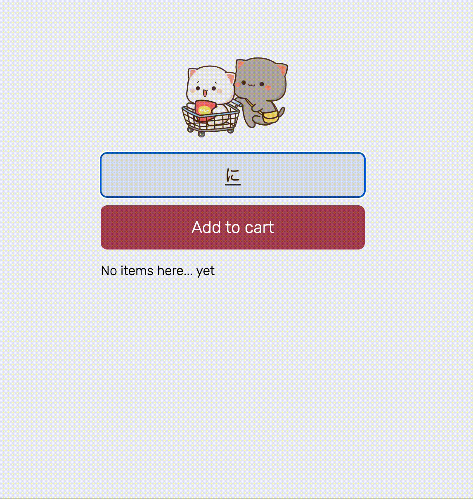

# 買い物リストアプリ

Firebase Realtime Databaseを使用して買い物リストを管理するWebアプリケーションです。

## デモ

## 機能

- 買い物リストへのアイテムの追加
- 買い物リストからアイテムの削除
- リアルタイムでデータベースとの同期

## 使い方

1. `index.html`ファイルをWebブラウザで開きます。
2. テキストフィールドにアイテムを入力し、「Add to Cart」ボタンをクリックします。
3. 買い物リストにアイテムが追加されます。
4. アイテムをダブルクリックすると、そのアイテムがリストから削除されます。

## 技術スタック

- HTML
- CSS
- JavaScript
- Firebase Realtime Database

## セットアップ

1. Firebase プロジェクトを作成し、Realtime Databaseを有効にします。
2. `index.js`ファイルの`firebase-config`にFirebase プロジェクトの設定情報を追加します。
